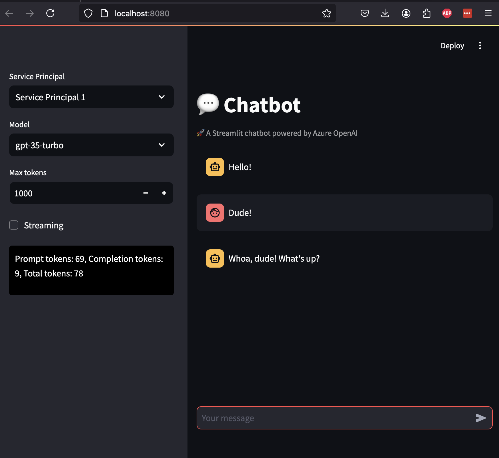

# OpenAI Chat Bot

## Overview
This repository contains a simple OpenAI ChatBot built in Python using the [Streamlit framework](https://streamlit.io/). It is a modified version of the [Streamlit sample ChatBot](https://github.com/streamlit/llm-examples/blob/main/Chatbot.py). It has been modified to integrate with the [AOAI (Azure OpenAI Service)](https://learn.microsoft.com/en-us/azure/ai-services/openai/overview).

Features include:

* Authentication to the AOAI service using Entra ID-based authentication with a service principal. It supports switching between two service principals to help with understanding how using Entra ID provides traceability in AOAI logs.
* Support for gpt-35-turbo and gpt-4o.
* Option to configure maximum tokens.
* Option to use streaming or non-streaming ChatCompletions.
* Option to include an image if using gpt-4o and to specify the detail of the image. Pillow is used to properly resize the image based on the user select either high or low detail.
* Displays the tokens used for each ChatCompletion including both streaming and non-streaming.
* Memory for the bot of the last 11 messages. After 7 messages the conversation history is summarized and returned to the bot to use for further memory.
* Personality of Bill from Bill and Ted's Excellent Adventure. 

## Prerequisites

1. You must have an Azure subscription and must be the owner of the subscription or a resource group within the subscription.
2. You must have an [Azure OpenAI Service instance deployed](https://learn.microsoft.com/en-us/azure/ai-services/openai/how-to/create-resource?pivots=web-portal).
3. You must have deploy gpt-35-turbo and gpt-4o to the Azure OpenAI Instance. The deployment names must match the model names above.
4. You must [create at least one service principal](https://learn.microsoft.com/en-us/cli/azure/azure-cli-sp-tutorial-1?tabs=bash) and [grant it the Azure RBAC Role Cognitive Services OpenAI User](https://learn.microsoft.com/en-us/azure/role-based-access-control/quickstart-assign-role-user-portal) on the Azure OpenAI Service instance.

## Setup
1. Clone the repository.
2. Create three files named .sp1_secret, .sp2_secret, and .variables. Sample files have been provided for you in this repository. If you have a single service principal you can put those credentials in both secret files.
3. Create a [Python virtual environment](https://docs.python.org/3/library/venv.html) and activate the virtual environment. You should be running Python 3.12 or later.
4. Install the [necessary libraries](https://packaging.python.org/en/latest/tutorials/installing-packages/).
5. Start the streamlit application.
   `streamlit run ChatBot.py --server.port 8080`
6. Party on dudes!
